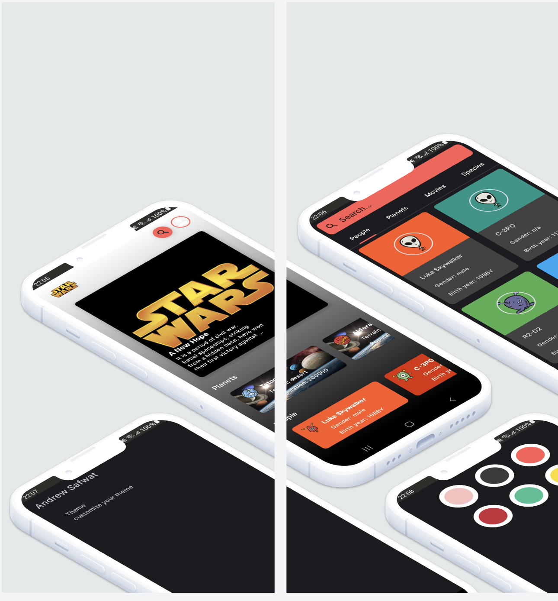
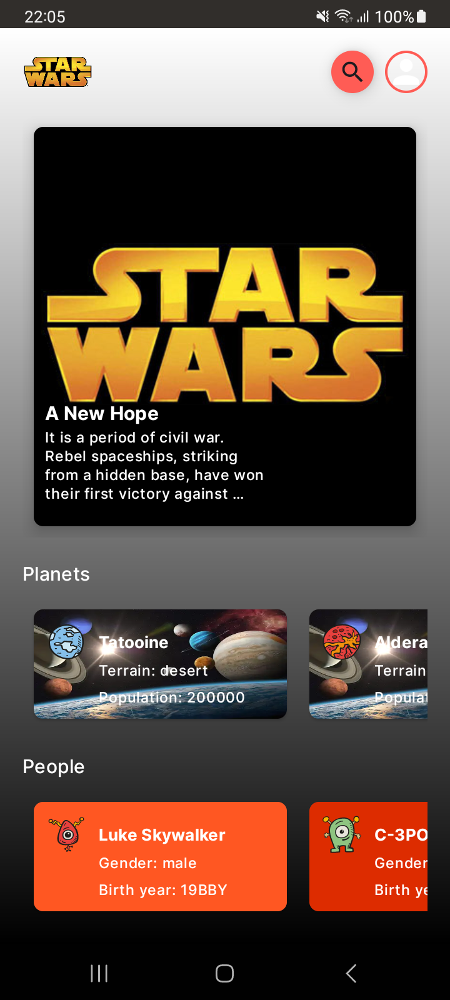
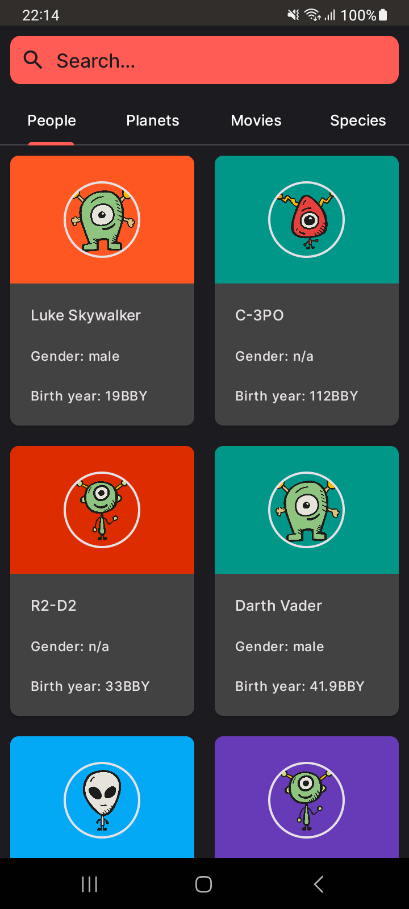
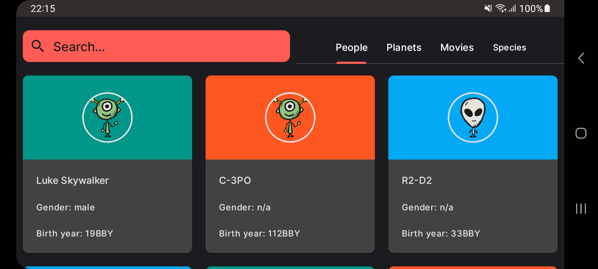
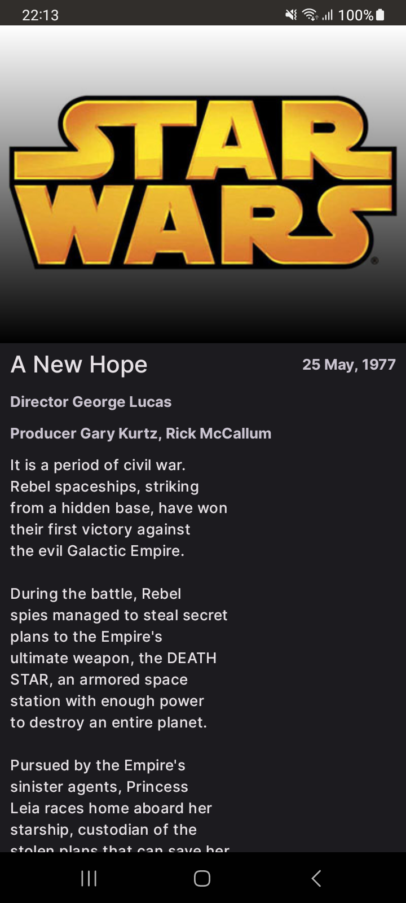
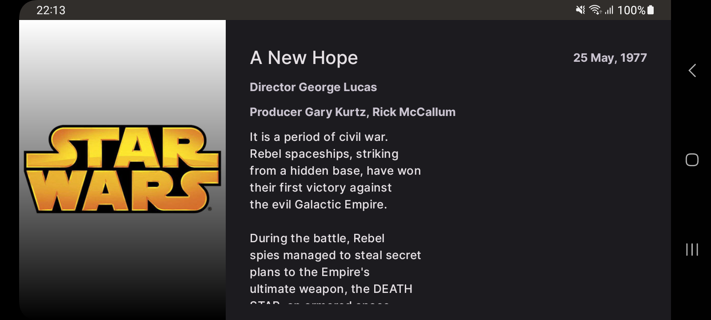
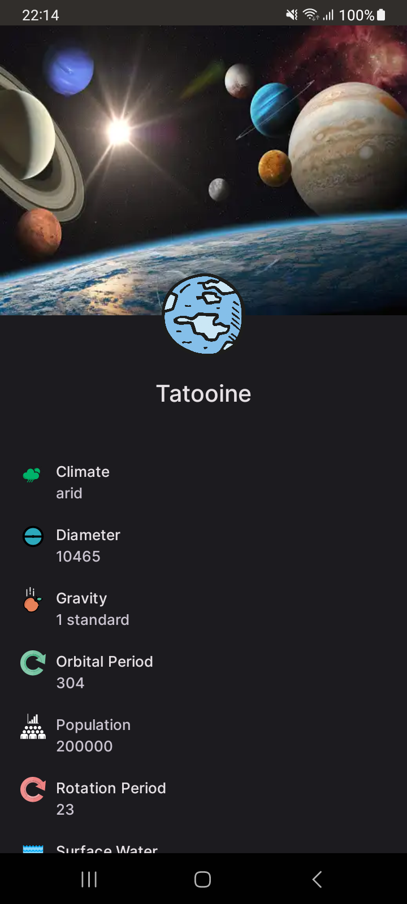
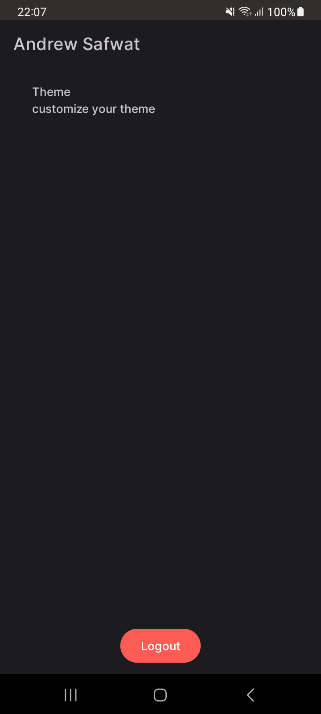
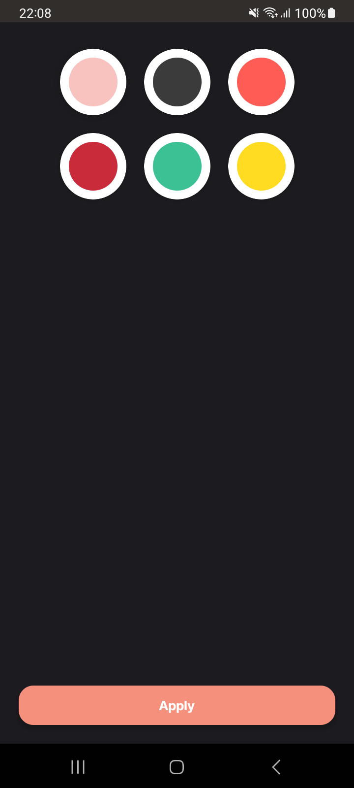

# Star wars universe
Star wars universe demonstrates modern Android development based on MVVM architecture with Hilt, Coroutines, Jetpack and Material Design 3.

### Tech stack & Open-source libraries
- Minimum SDK level 26
- [Kotlin](https://kotlinlang.org/)
  based, [Coroutines](https://github.com/Kotlin/kotlinx.coroutines)
    + [Flow](https://kotlin.github.io/kotlinx.coroutines/kotlinx-coroutines-core/kotlinx.coroutines.flow/)
      for asynchronous.
- Jetpack
    - Lifecycle: Observe Android lifecycles and handle UI states upon the lifecycle changes.
    - ViewModel: Manages UI-related data holder and lifecycle awareness. Allows data to survive
      configuration changes such as screen rotations.
    - DataBinding: Binds UI components in your layouts to data sources in your app using a declarative
      format rather than programmatically.
    - [Hilt](https://dagger.dev/hilt/): for dependency injection.
- Architecture
    - MVVM Architecture (View - DataBinding - ViewModel - Model)
    - Clean architecture
    - Repository Pattern
- [Retrofit2 & OkHttp3](https://github.com/square/retrofit): Construct the REST APIs and paging network data.
- [Firebase Google Auth](https://firebase.google.com/docs/auth):
  Firebase Authentication provides backend services, easy-to-use SDKs, and ready-made UI libraries to authenticate users to your app. It supports authentication using passwords, phone numbers, and popular federated identity providers like Google, Facebook, and Twitter.
- [MotionLayout](https://developer.android.com/develop/ui/views/animations/motionlayout):  Layout type that helps you manage motion and widget animation in your app.
- [GSON](https://github.com/google/gson): A modern JSON library for Kotlin and Java.
- [Coil](https://coil-kt.github.io/coil): Image loading framework for Android that wraps media decoding

## Responsive design
Responsive design responds to different screen sizes, devices, and orientations. The primary goal of responsive design is to ensure that the user experience is consistent and optimal across all devices, whether a tablet or smartphone.
### Screenshots

#### Choose your favorite theme
You can easily change the application's primary color to your favorite one
